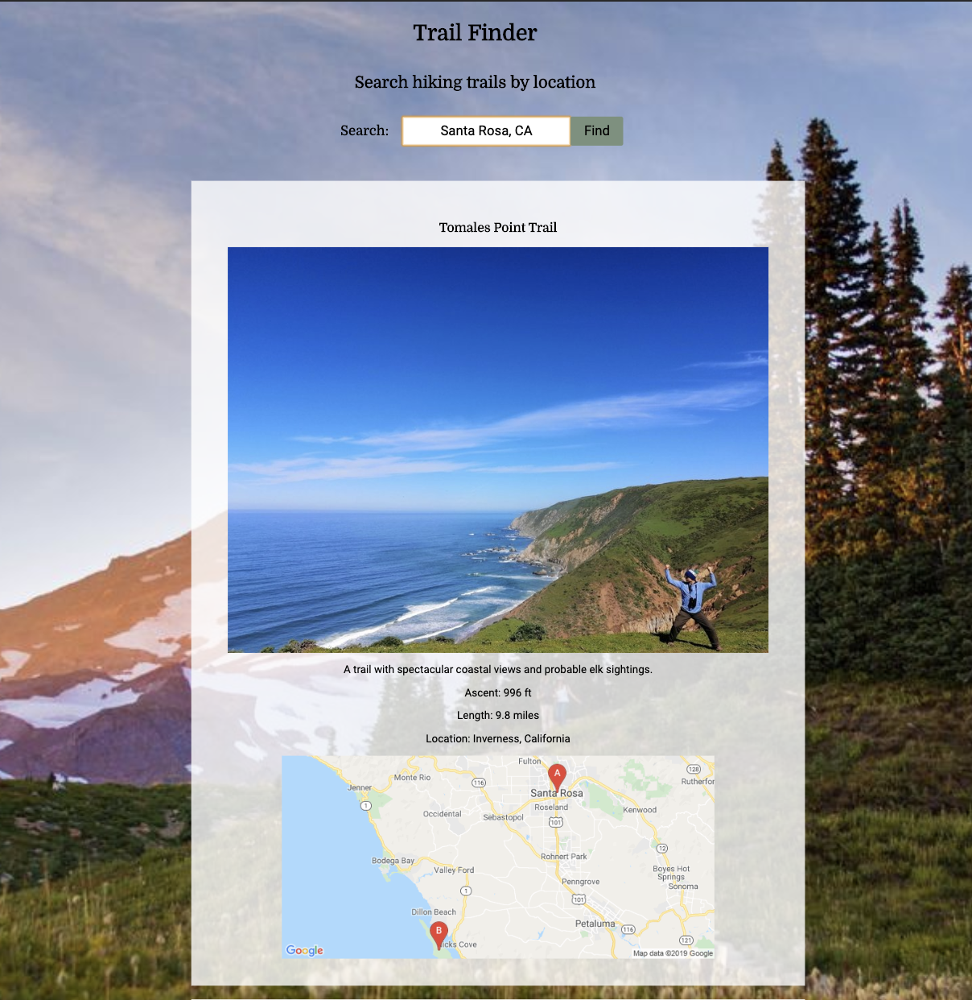
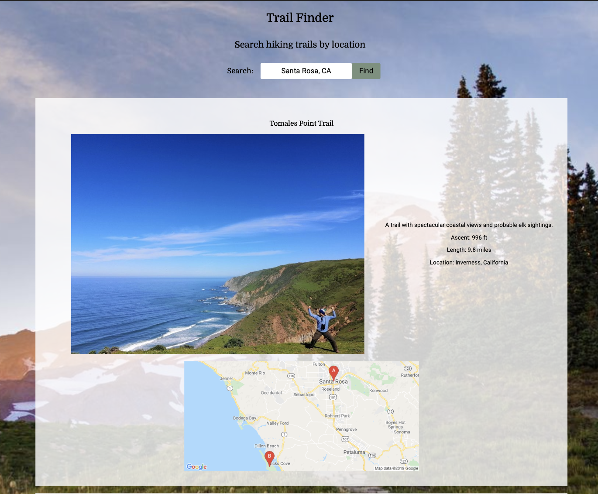

This app is called Trail Finder

https://jaggersofia.github.io/Trail-Finder/

Summary:  
This app allows the user to search for trails by geographical locations. The results have the name of the trail, an image of the trail, other important factors in deciding to hike a specific trail, i.e. distance and elevation. It also contains a map of the area that the trail is located. 

Technologies used:  
HTML
CSS
JavaScript
jQuery
